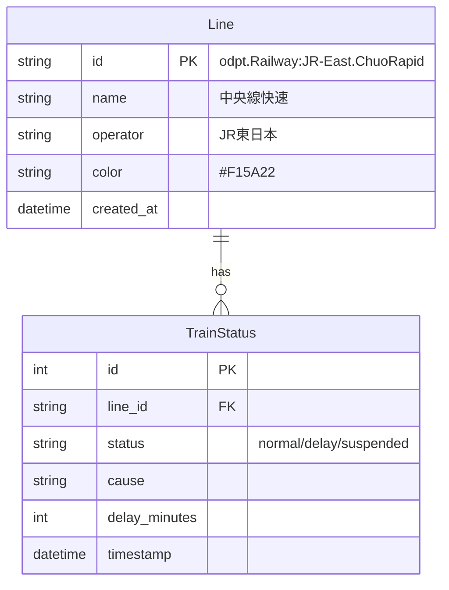

# DBスキーマ設計

## ER図



---

## テーブル定義

### lines（路線マスター）

| カラム | 型 | NULL | 説明 |
|---|---|---|---|
| id | VARCHAR(100) | NO | 主キー（ODPT形式ID） |
| name | VARCHAR(50) | NO | 路線名 |
| name_en | VARCHAR(50) | YES | 路線名（英語） |
| operator | VARCHAR(50) | NO | 運営会社 |
| color | VARCHAR(7) | YES | ラインカラー（HEX） |
| created_at | DATETIME | NO | 作成日時 |
| updated_at | DATETIME | NO | 更新日時 |

**インデックス**
- PRIMARY KEY (id)

---

### train_statuses（運行状況履歴）

| カラム | 型 | NULL | 説明 |
|---|---|---|---|
| id | INTEGER | NO | 主キー（自動増分） |
| line_id | VARCHAR(100) | NO | 外部キー → lines.id |
| status | VARCHAR(20) | NO | normal / delay / suspended |
| cause | VARCHAR(200) | YES | 遅延・運休の原因 |
| delay_minutes | INTEGER | YES | 遅延時間（分） |
| timestamp | DATETIME | NO | 記録日時 |

**インデックス**
- PRIMARY KEY (id)
- INDEX (line_id)
- INDEX (timestamp)
- INDEX (line_id, timestamp)

---

## 設計方針

### 1. 正規化
- 路線情報は `lines` テーブルに分離（マスターデータ）
- `train_statuses` は履歴データとして蓄積

### 2. パフォーマンス
- `(line_id, timestamp)` の複合インデックスで時間範囲クエリを高速化
- 過去データは定期的にアーカイブ or 削除を検討

### 3. 拡張性
- 将来的に `stations`（駅マスター）を追加可能
- `weather`（天気情報）との紐付けも検討

---

## マイグレーション

既存の `traffic_logs` テーブルから移行する際の手順：

1. 新テーブル `lines`, `train_statuses` を作成
2. 既存データを移行
3. `traffic_logs` を削除

```sql
-- 1. 新テーブル作成
CREATE TABLE lines (...);
CREATE TABLE train_statuses (...);

-- 2. データ移行
INSERT INTO lines (id, name, operator, color, created_at, updated_at)
VALUES 
  ('odpt.Railway:JR-East.ChuoRapid', '中央線快速', 'JR東日本', '#F15A22', NOW(), NOW()),
  ...;

INSERT INTO train_statuses (line_id, status, cause, delay_minutes, timestamp)
SELECT route_id, description, NULL, delay_minutes, timestamp FROM traffic_logs;

-- 3. 旧テーブル削除
DROP TABLE traffic_logs;
```
