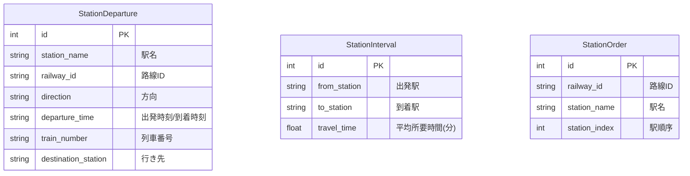

# DBスキーマ設計

## ER図

---

## テーブル詳細

### 1. `station_departures` (時刻表データ)
列車の発着情報を格納。経路探索の核となるデータ。
`fetch_timetables.py` により `odpt:TrainTimetable` から生成される。

| カラム | 型 | 説明 | 備考 |
|---|---|---|---|
| id | Integer | PK | |
| station_id | String | 駅ID | `odpt.Station:JR-East.Chuo.Tokyo` |
| station_name | String | 駅名 | `Tokyo` |
| railway_id | String | 路線ID | `odpt.Railway:JR-East.Chuo` |
| direction | String | 方面 | `Outbound` / `Inbound` |
| departure_time | String | 時刻 | `HH:MM` 形式 (終着駅は到着時刻) |
| train_type | String | 列車種別 | `Rapid`, `Local` 等 |
| destination_station | String | 行き先駅名 | |
| train_number | String | 列車番号 | `1234F` |
| weekday_type | String | 曜日区分 | `Weekday`, `Saturday`, `Holiday` |

**インデックス**:
- `(station_name, direction, departure_time)`: 経路探索の列車検索用

---

### 2. `station_intervals` (駅間所要時間)
隣接する駅間の平均所要時間を格納。グラフのエッジ重みとして使用。
`extract_travel_times.py` により実績ダイヤから算出される。

| カラム | 型 | 説明 | 備考 |
|---|---|---|---|
| id | Integer | PK | |
| from_station_id | String | 出発駅ID | |
| to_station_id | String | 到着駅ID | |
| from_station | String | 出発駅名 | |
| to_station | String | 到着駅名 | |
| travel_time | Float | 所要時間(分) | 0時またぎを考慮した平均値 |
| railway_id | String | 路線ID | |

---

### 3. `station_orders` (駅順序マスタ)
路線の駅順序情報。方向判定（上り/下り）に使用。
`fetch_station_order.py` により生成。

| カラム | 型 | 説明 | 備考 |
|---|---|---|---|
| id | Integer | PK | |
| railway_id | String | 路線ID | |
| station_id | String | 駅ID | |
| station_name | String | 駅名 | |
| station_index | Integer | 順序 | 1からの連番 |

**特記ロジック**:
- 山手線などの環状線は、インデックス差分と閾値を比較して時計回り/反時計回りを判定する。
