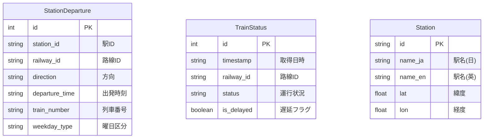

# DBスキーマ設計

## ER図

```mermaid
erDiagram
    StationDeparture {
        int id PK
        string station_id "駅ID"
        string railway_id "路線ID"
        string direction "方向"
        string departure_time "出発時刻"
        string train_number "列車番号"
        string weekday_type "曜日区分"
    }

    TrainStatus {
        int id PK
        string timestamp "取得日時"
        string railway_id "路線ID"
        string status "運行状況"
        boolean is_delayed "遅延フラグ"
    }

    Station {
        string id PK
        string name_ja "駅名(日)"
        string name_en "駅名(英)"
        float lat "緯度"
        float lon "経度"
    }
```

---

## テーブル詳細

### 1. `station_departures` (時刻表データ)
列車の発着情報を格納。時刻表ベースの経路探索に使用。

| カラム | 型 | 説明 | 備考 |
|---|---|---|---|
| id | Integer | PK | |
| station_id | String | 駅ID | `odpt.Station:JR-East.Chuo.Tokyo` |
| station_name | String | 駅名 | |
| railway_id | String | 路線ID | |
| direction | String | 方面 | `Outbound` / `Inbound` |
| departure_time | String | 時刻 | `HH:MM` |
| train_type | String | 列車種別 | |
| destination_station | String | 行き先 | |
| train_number | String | 列車番号 | |
| weekday_type | String | 曜日区分 | `Weekday`, `Saturday`, `Holiday` |

### 2. `train_statuses` (運行情報履歴)
odpt:TrainInformation から取得した運行情報の履歴。遅延リスク分析の基礎データ。

| カラム | 型 | 説明 | 備考 |
|---|---|---|---|
| id | Integer | PK | |
| timestamp | String | 取得日時 | ISO 8601 (JST) |
| railway_id | String | 路線ID | |
| railway_name | String | 路線名 | `中央線快速` など |
| operator | String | 事業者ID | |
| status | String | 状況 | `平常運転`, `遅延` など |
| status_text | String | 詳細テキスト | 遅延理由など |
| is_delayed | Boolean | 遅延フラグ | 平常運転以外はTrue |

### 3. `stations` (統合駅マスタ)
JR、メトロ、都営の全駅を統合したマスタデータ。

| カラム | 型 | 説明 | 備考 |
|---|---|---|---|
| id | String | PK (駅ID) | |
| name_ja | String | 駅名(日本語) | |
| name_en | String | 駅名(英語) | |
| railway_id | String | 所属路線ID | |
| station_code | String | 駅ナンバリング | `M17` など |
| lat, lon | Float | 座標 | |

### 4. `railways` (統合路線マスタ)

| カラム | 型 | 説明 | 備考 |
|---|---|---|---|
| id | String | PK (路線ID) | |
| name_ja | String | 路線名(日本語) | |
| operator_id | String | 事業者ID | |

### 5. `route_edges` (経路グラフエッジ)
計算済みの駅間接続データ。

| カラム | 型 | 説明 | 備考 |
|---|---|---|---|
| id | Integer | PK | |
| from_station_id | String | 出発駅ID | |
| to_station_id | String | 到着駅ID | |
| time_minutes | Float | 所要時間(分) | |
| type | String | エッジタイプ | `ride` (乗車) or `transfer` (乗換) |

### 6. Others
- `station_orders`: 方面判定用の駅順序データ
- `station_intervals`: 実績ダイヤに基づく駅間所要時間
