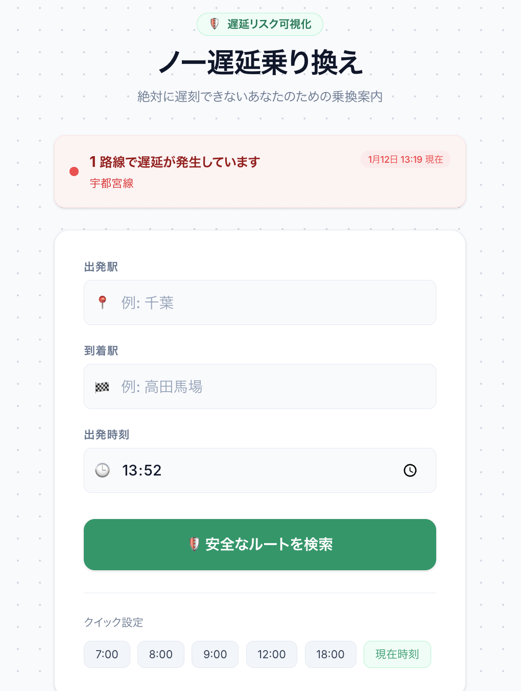
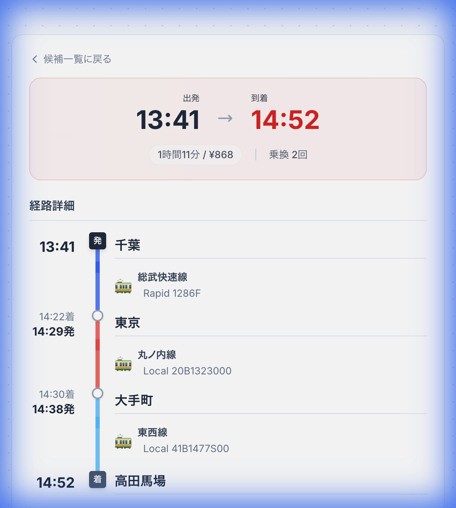

# ノー遅延乗り換え - 遅延リスクを避けるルート検索

[](https://challenge2025.odpt.org/)

> **🛡️ 絶対に遅刻できないあなたのための乗換案内**  
> 過去の運行データから遅延リスクを予測し、「安全に到着できるルート」を提案します。

---

## デモ

**[https://tatsuki.dev/opendata/](https://tatsuki.dev/opendata/)**

<p align="center">
  
  
</p>

---

##  使い方ガイド

### Step 1: 出発駅・到着駅を入力
トップ画面で出発駅と到着駅を入力します。クイック設定ボタンで時刻をワンタップ選択できます。

### Step 2: 安全なルートを検索
「🛡️ 安全なルートを検索」ボタンをタップすると、複数のルート候補が表示されます。

### Step 3: ルートを比較
各ルートには4つのスコアが表示されます:
- **速さ** ⏱️ : 所要時間
- **快適** 🛋️ : 混雑度・乗り換えの楽さ
- **安定** 🛡️ : 遅延リスクの低さ（独自指標）
- **安さ** 💰 : 運賃

### Step 4: 詳細を確認
「詳細を見る」で経路のタイムラインを表示。リスクの高い区間は色で強調されます。

---

## 技術的な独自性

### 1. Predictive Risk Engine（遅延予測エンジン）
- **過去の運行データを統計分析**し、「現在遅延していなくても、この時間帯・この路線は遅延しやすい」という潜在リスクを算出
- 単なるリアルタイム情報ではなく、**予測型のリスク評価**を実現

### 2. 4軸スコアリングによるルート評価
- 従来の「速さ」一辺倒ではなく、**速さ・快適・安定・安さ**の4軸で多角的に評価
- ユーザーの重視する価値に応じた最適ルートを提案

### 3. AI Concierge（生成AIによる診断）
- OpenAI GPT-4o-mini を活用し、「このルートは混雑しやすい」「荷物が多い場合は別ルートを」など**文脈を理解したアドバイス**を生成

### 4. マルチソースデータ統合
- **ODPT API + GTFS** データを統合し、JR東日本・東京メトロ・都営地下鉄を横断したルート検索を実現

---

## 技術スタック

### Backend
   

- **Python 3.12** / **FastAPI**
- **SQLite + SQLAlchemy**: グラフデータと統計データの高速処理
- **OpenAI API**: GPT-4o-mini による診断
- **ODPT API & GTFS**: JR東日本、東京メトロ、都営地下鉄のデータを統合

### Frontend
   

- **Vite** / **JavaScript** (No Framework overhead)
- **Tailwind CSS v4**: 最新のスタイリングエンジン
- **Design System**: Glassmorphism, Adaptive Colors

### Deployment Architecture
**完全自動化された、スケーラブルな遅延予測サービス** を目指し、以下の構成で運用します。

| Layer | Service | Details |
|---|---|---|
| **Frontend** | **GitHub Pages** | 静的ホスティング。`VITE_API_URL`でバックエンドと通信。 |
| **Backend** | **DigitalOcean App Platform** | Dockerコンテナとしてデプロイ。オートスケール対応。 |
| **Database** | **DO Managed PostgreSQL** | SQLiteから移行。フルマネージドで運用。 |
| **Automation** | **GitHub Actions** | 10分毎にデータを収集し、直接DBへINSERT。 |


---

## ディレクトリ構成
```
.
├── backend/
│   ├── main.py              # Entry point
│   ├── routers/             # API Endpoints (AI, Search, Stations)
│   ├── services/            # Core Logic (Risk, Routing, Venue)
│   ├── scripts/             # Data fetchers & importers
│   │   ├── fetchers/        # Raw data collectors
│   │   └── importers/       # DB importers
│   └── data/                # Raw Data & SQLite DB
│
└── frontend/
    ├── src/
    │   ├── components/      # UI Components (Timeline, Risk Cards)
    │   └── pages/           # Page Logic
    └── index.html
```

---

## 📂 使用したオープンデータ

本アプリケーションは、以下のオープンデータを活用しています。

| データ提供元 | データ種別 | 用途 |
|---|---|---|
| [公共交通オープンデータセンター](https://ckan.odpt.org/) | ODPT API | リアルタイム運行情報・遅延情報の取得 |
| JR東日本 | GTFS / GTFS-RT | 時刻表・リアルタイム列車位置情報 |
| 東京メトロ | 列車運行情報API | 運行状況・遅延情報 |
| 都営地下鉄 | 運行データ | 時刻表・運行状況 |

> **ライセンス**: 公共交通オープンデータセンターが定める[利用規約](https://developer.odpt.org/terms)に基づき利用しています。

---

## ライセンス
MIT License
