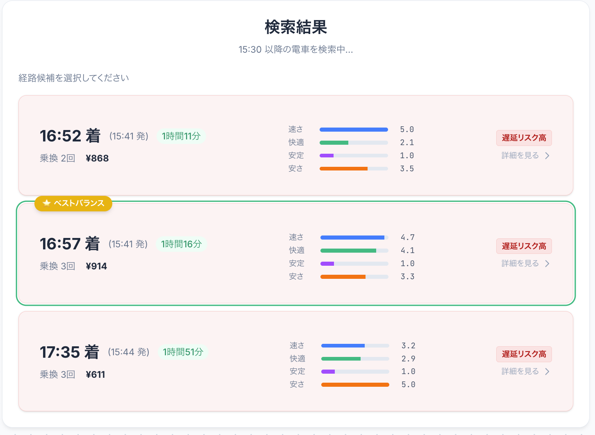

# 🚃 ノー遅延乗り換え - 遅延リスクを避けるルート検索

[](https://challenge2025.odpt.org/)


> **「今の時間は平常通りです」...その言葉を信じて遅刻したことはありませんか？**
> 
> 既存の乗換案内は「現在」の遅延しか教えてくれません。しかし、私たちは**未来**を予測します。
> 過去の膨大な運行データから**今の平穏に隠れた遅延リスク**を暴き出し、「絶対に遅刻できないあなた」を目的地まで安全に送り届ける。それが『ノー遅延乗り換え』です。

---

## 🚀 本番サイト

<table align="center">
  <tr>
    <td align="center" width="33%">
      
      <br>
      <b>トップ画面</b><br>
      直感的な検索インターフェース
    </td>
    <td align="center" width="33%">
      
      <br>
      <b>ルート比較</b><br>
      4軸スコアで最適な選択
    </td>
    <td align="center" width="33%">
      
      <br>
      <b>詳細・リスク表示</b><br>
      未来の遅延リスクを可視化
    </td>
  </tr>
</table>

---

## 🔥 コンテストに向けた技術的挑戦

本アプリケーションは、既存のAPIをラップしただけのツールではありません。
**「いかに速く着くか」ではなく「いかに確実に着くか」** という問いに答えるため、以下のコア技術を**フルスクラッチで独自実装**しました。

### 1. 独自実装のグラフ探索エンジン（脱・既存API）
通常の乗換案内APIでは「最短経路」が優先され、「少し遠回りでもリスクの低いルート」を柔軟に探すことは困難です。そこで、私たちはグラフ構造の構築から探索アルゴリズム（Dijkstra法）までを完全に内製化しました。

- **動的ウェイト制御**:
    - 距離や時間だけでなく、「乗り換えの複雑さ」「混雑イベント」「過去の遅延傾向」をコストとして重み付け。
    - **「時間はかかるが、絶対に座れて遅延も少ない地下鉄ルート」** のような提案を可能にしました。
- **ペナルティ法による強制迂回**:
    - 通常の探索で見つかった主要ルートに仮想的なペナルティを与えて再探索することで、**物理的に異なる代替ルート（迂回路）** を強制的に導出。事故で主要幹線が全滅した際も、生き残っているルートを即座に提示します。

### 2. 未来のリスクを可視化する "Predictive Risk Engine"
「今、遅れていない」ことは「これからも遅れない」ことを保証しません。

- **独自のデータ蓄積**:
    - オープンデータAPIを継続的に監視し、**数ヶ月にわたるリアルタイム遅延データ**を蓄積・解析。
- **リスクの数値化**:
    - 「金曜日、xx線のxx時台は遅延確率が30%上がる」といった傾向を統計的に導出し、**現在は正常運行でも、到着予定時刻に遅延するリスクが高いルート**には警告を出します。

### 3. AIコンシェルジュによる意思決定支援
数字だけでは伝わらない「現場の空気感」を伝えるため、生成AI (GPT-4o-mini) を統合しました。
- 「このルートは乗換回数は少ないですが、イベント終了後のドーム周辺を通るため、避けた方が無難です」

といった、**コンシェルジュのような定性的なアドバイス**を提供します。

---

## ✨ 機能ハイライト

### ユーザーの意思決定を支える「4軸スコアリング」
単一の正解を押し付けることはしません。4つの指標でルートを評価し、ユーザーの状況に合わせて選べるようにしています。

| 指標 | 説明 |
|---|---|
| **速さ** | 単純な所要時間。急いでいる時に。 |
| **快適** | 混雑度や乗り換え回数を考慮。疲れている時に。 |
| **安定** | 過去の統計に基づく遅延リスクの低さ。重要な予定の時に。 |
| **安さ** | 運賃の安さ。 |

---

## 📖 使い方ガイド

詳しい操作方法や、本アプリの特徴である「遅延リスク予測」「AIコンシェルジュ」の活用例については、以下のマニュアルをご覧ください。

👉 **[ユーザーマニュアル (MANUAL.md)](docs/MANUAL.md)**

---

## 🛠️ 技術スタック

堅牢なバックエンドと、UXを追求したフロントエンドをモダンな技術で統合しています。

### Backend
   

- **Core**: Python 3.12, **FastAPI**
- **Database**: PostgreSQL
- **AI**: OpenAI API (GPT-4o-mini)
- **Data Source**: ODPT API, GTFS-RT (JR東日本, 東京メトロ, 都営地下鉄)

### Frontend
   

- **Framework**: **Vite** + Vanilla JavaScript
- **Styling**: **Tailwind CSS v4**
- **Hosting**: GitHub Pages

### Infrastructure / DevOps
- **Hosting**: DigitalOcean App Platform (Backend), GitHub Pages (Frontend)
- **CI/CD**: GitHub Actions (10分ごとのデータ収集・自動デプロイ)

---

## 📂 ディレクトリ構成

```plaintext
.
├── backend/
│   ├── main.py              # アプリケーションエントリーポイント
│   ├── services/            # コアロジック
│   │   ├── routing.py       # 独自グラフ探索エンジン
│   │   ├── risk.py          # 遅延リスク予測ロジック
│   │   └── ai.py            # AIコンシェルジュ
│   ├── scripts/             # データ収集基盤
│   │   └── fetchers/        # 継続的なデータ収集スクリプト群
│   └── data/                # 蓄積された統計データ
│
└── frontend/
    ├── src/                 # UIロジック
    └── index.html           # エントリーポイント
```

---

## 📊 使用したオープンデータ

本アプリケーションは、以下のオープンデータを活用し、独自の解析を加えて価値を創出しています。

| データ提供元 | データ種別 | 活用方法 |
|---|---|---|
| [公共交通オープンデータセンター](https://ckan.odpt.org/) | ODPT API | リアルタイム運行情報・遅延情報の取得 |
| JR東日本 | GTFS / GTFS-RT | 時刻表・リアルタイム列車位置情報の解析 |
| 東京メトロ | 列車運行情報API | 運行履歴の統計分析 |
| 都営地下鉄 | 運行データ | 独自グラフネットワークの構築 |

> **ライセンス**: 公共交通オープンデータセンターが定める[利用規約](https://developer.odpt.org/terms)に基づき利用しています。

---

## 📜 License
MIT License
